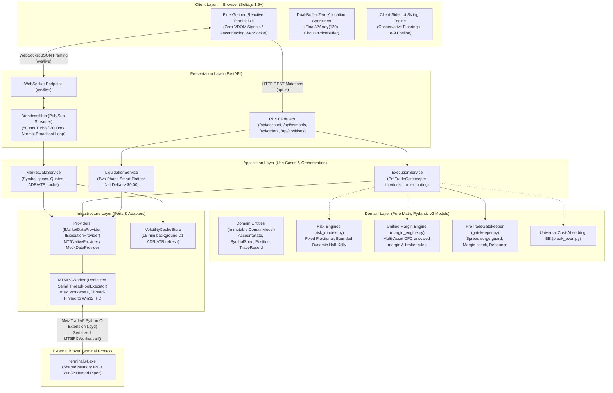
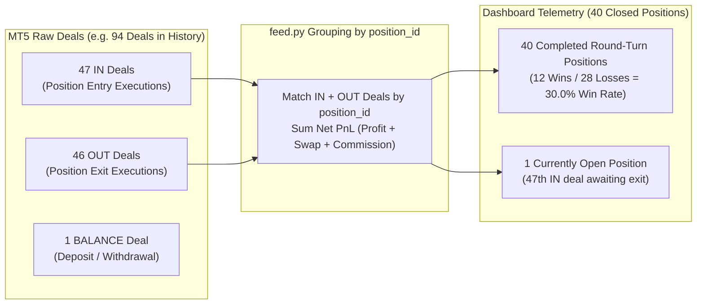

# 🏛️ MT5 Risk Management Dashboard — Concurrency & System Architecture

This document details the backend and frontend concurrency model, Hexagonal / Ports & Adapters system architecture, thread pool allocations, MT5 C-extension serialization, WebSocket streaming loops, and the quantitative mathematical aggregation engine.

---

## 🏗️ High-Level Hexagonal / Ports & Adapters Architecture

The system decouples presentation, application orchestration, domain mathematics, and infrastructure I/O into a clean **Hexagonal (Ports & Adapters)** architecture. It bridges an asynchronous event loop (FastAPI/Uvicorn) with a dedicated single-threaded MetaTrader 5 C-extension worker queue (`MT5IPCWorker`) and a centralized WebSocket Pub/Sub broadcast hub (`BroadcastHub`).



---

## 🧵 Concurrency Model & Thread Breakdown

| Component | Thread Allocation / Execution Context | Primary Role | Blocking & Concurrency Behavior |
| :--- | :---: | :--- | :--- |
| **Main Event Loop** | **1 Thread** *(Main OS Thread)* | Runs FastAPI, Uvicorn, HTTP REST endpoints, WebSocket JSON serialization, and async task orchestration. | **Non-blocking**. Never invokes synchronous broker calls or disk I/O directly. |
| **Broadcast Hub Producer Task** | **1 Asyncio Task** *(within Event Loop)* | Samples MT5 data at configured cadence (500ms Turbo / 2000ms Normal) and broadcasts frames to all subscribers. | **Pub/Sub Fan-Out**. Decouples client connections from MT5 polling. Eliminates per-client polling storms ($O(1)$ IPC calls regardless of active tabs). |
| **MT5 Dedicated Serial Worker (`MT5IPCWorker`)** | **1 Dedicated OS Thread** (`ThreadPoolExecutor(max_workers=1, thread_name_prefix="MT5_IPC_Serial")`) | Serializes all `MetaTrader5` C-extension calls (`symbol_info_tick`, `account_info`, `order_send`, `positions_get`). | **Thread-Pinned Serialization**. Prevents Win32 IPC handle corruption (`0xC0000005`) by pinning MT5 calls to a single thread ID. Calls run via `await worker.call(...)`. Never locks caller thread. |
| **Background Volatility Task** | **1 Asyncio Task** *(Lifespan Worker)* | Recalculates 14-day D1 Average Daily Range ($\text{ADR}_{14}$) and Average True Range ($\text{ATR}_{14}$) every 15 minutes. | **Non-blocking Background Worker**. Offloaded via `MT5IPCWorker.call()`. Pre-populates thread-safe cache, keeping tick polling sub-millisecond. |
| **MT5 Terminal Engine** | **External Process** (`terminal64.exe`) | Local broker terminal managing live price feeds, order books, position tracking, and execution routing. | Serves cached price ticks and open positions over Win32 shared memory in **< 1 millisecond**. |

---

## ⏱️ WebSocket Streaming & Polling Cadences

The backend coordinates real-time data flows to balance institutional sub-second responsiveness with minimal IPC and network overhead:

### 1. Centralized Pub/Sub Market Broadcast (`BroadcastHub`)
* **Interval**: **500ms** (Turbo Mode) or **2000ms** (Normal Mode).
* **Payload**: Live Bid/Ask quotes, spread, today's session range, ADR exhaustion percentage, directional room (up/down), account metrics (balance, equity, free margin, margin level), and open positions.
* **Flow**:
  1. The single background producer coroutine wakes on interval timer (`asyncio.sleep`).
  2. Invokes `market_service.get_market_symbols()`, `get_account_summary()`, and `get_open_positions()`.
  3. Work is scheduled onto the dedicated serial thread via `MT5IPCWorker.call()`.
  4. The returned typed domain models are serialized to JSON immediately before fan-out.
  5. `BroadcastHub.broadcast()` pushes the frame concurrently across all connected client WebSockets. If a socket disconnects or slows, it is dropped cleanly without blocking the producer.

### 2. Strategy Performance Telemetry Heartbeat
* **Interval**: **Every 5.0 seconds** (or triggered on position closures).
* **Payload**: Total closed trades, win rate, payoff ratio, profit factor, bounded Dynamic Half-Kelly fraction ($f^*/2$), and sample-size confidence tiers.
* **Flow**:
  1. Dispatches `market_service.get_trade_statistics()` via `MT5IPCWorker.call()`.
  2. Reconstructs completed round-turn trade setups from raw MT5 deal history (`fetch_trade_history`).
  3. Bundles updated strategy statistics into the broadcast payload.

### 3. Session ADR Exhaustion & Volatility Telemetry
* **Interval**: **Every 500ms tick frame**.
* **Payload**: Real-time session extremes ($\text{Range}_{\text{today}} = \text{High}_{\text{today}} - \text{Low}_{\text{today}}$), session absorption ($\text{ADR Used } \% = \frac{\text{Range}_{\text{today}}}{\text{ADR}_{14}} \times 100\%$), and directional headroom ($\text{Room Up}$, $\text{Room Down}$).
* **Flow**:
  1. Queries intraday D1 bar 0 (`copy_rates_from_pos(sym, TIMEFRAME_D1, 0, 1)`) on the serial worker.
  2. Combines with cached 14-day D1 baseline from `VolatilityCacheStore`.
  3. Emits 3-state exhaustion metrics consumed by client micro-gauges (`NORMAL < 70%`, `EXPANSION 70%–89%`, `EXHAUSTED ≥ 90%`).

### 4. Background Volatility Refresh Task
* **Interval**: **Every 15 minutes** (900 seconds).
* **Payload**: 14-day Daily Average Daily Range ($\text{ADR}_{14}$) and Average True Range ($\text{ATR}_{14}$) in pips for all symbols.
* **Flow**: Runs in the background via FastAPI lifespan manager, refreshing the in-memory cache to eliminate historical candle queries during live quote streaming.

---

## 🛡️ Pre-Trade Risk Interlocks & Execution Pipeline

Order execution follows a strict 3-stage validation pipeline inside `ExecutionService`:

```mermaid
flowchart LR
    A["Incoming Order Request\n(executeOrder)"] --> B{"1. Debounce &\nIdempotency Check"}
    B -->|Passed (<300ms duplicate blocked)| C{"2. Spread Surge Guard\n(current <= 2.5x median)"}
    B -->|Rejected| R1["HTTP 429 / Rejection Toast\n(Duplicate In-Flight)"]
    C -->|Passed| D{"3. Margin Health Check\n(Req Margin <= Free * 0.95)"}
    C -->|Breached| R2["Rejection: Spread Surge\n(News / Rollover Spike)"]
    D -->|Passed| E["MT5IPCWorker.call()\n(send_market_order)"]
    D -->|Breached| R3["Rejection: Margin Exhaustion\n(Exceeds Free Margin)"]
    E --> F["Broker Fill / Confirmation\n(Ticket ID, 400ms dwell)"]
```

### 🚨 Smart Flatten ($0.00 Net Delta) Engine
Emergency liquidation executed via `LiquidationService.flatten_all()` implements an institutional **two-phase atomic sequence**:
1. **Phase 1 (Order Book Purge)**: Cancels 100% of resting pending orders (`TRADE_ACTION_REMOVE` for Buy/Sell Limits, Buy/Sell Stops).
2. **Phase 2 (Market Liquidation)**: Liquidates 100% of open market positions (`TRADE_ACTION_DEAL`).
3. **Outcome**: Guarantees true $0.00$ Net Delta account exposure, preventing latent order fills when volatility surges post-exit.

---

## 📊 Trade Accounting: Positions vs. Deals

Understanding how MT5 represents trades is critical when comparing dashboard telemetry against MetaTrader 5 native reports:



### Why MT5 Reports and Dashboard Metrics Differ:

| Dimension | Dashboard Metric | MT5 Report Summary | Mathematical Rationale |
| :--- | :---: | :---: | :--- |
| **Unit of Account** | **Completed Position** | **Exit Deal (Fill)** | The dashboard groups all scale-in and scale-out fills into one round-turn trade setup. MT5 counts each partial fill individually. |
| **Sample Trade Count** | **40 Trades** | **46 Trades** | Scaled-out positions (e.g. 50% TP1 + 50% TP2) produce multiple exit fills ($40 + 6 = 46$). |
| **Statistical Win Rate** | **30.0%** (12W / 28L) | **30.43%** (14W / 32L) | Position-level win rate accurately reflects setup profitability without distortion from multiple partial profit takes. |
| **Risk Sizing Compatibility** | **Optimal for Kelly Criterion** | Distorts Averages | Risk algorithms assume **independent trade events**. Slicing trades into partial fills artificially shrinks average win size and inflates win count. |
| **Van Tharp 1R Normalization** | **Normalized $R$-Multiples** | Raw Fiat PnL | De-biases trading psychology by expressing profit/loss in baseline risk units ($1R_{\text{cash}} = \text{Working Capital} \times \text{Risk \%}$). |

---

## ⚡ Client-Side Fine-Grained Reactivity & Mathematical Parity

1. **Zero-VDOM Fine-Grained Signals**:
   - Built on Solid.js 1.9+. Streaming updates modify leaf text and attribute nodes directly without Virtual DOM diffing overhead ($<0.1\text{ms}$ DOM updates at 60 FPS).
2. **Full-Stack Mathematical Parity**:
   - Volume calculations enforce **Risk As Strict Ceiling** via flooring with a floating-point epsilon ($+10^{-9}$):
     $$\text{Stepped Lot} = \lfloor \frac{\text{Exact Lot}}{\text{Volume Step}} + 10^{-9} \rfloor \times \text{Volume Step}$$
   - Implemented identically in TypeScript (`src/utils/lotCalculator.ts`) and Python (`domain/math/risk_models.py`), verified by automated unit tests.
3. **Class-Internal Dual-Buffer Sparklines**:
   - `CircularPriceBuffer` owns both its internal ring buffer (`Float32Array(120)`) and chronological unrolled buffer.
   - Computes min, max, first, and last values in a single memory sweep with **zero heap allocations** on 500ms tick arrivals.
   - Canvas rendering is strictly gated to pinned and hovered symbols, preserving 60 FPS performance on high-DPI displays.

